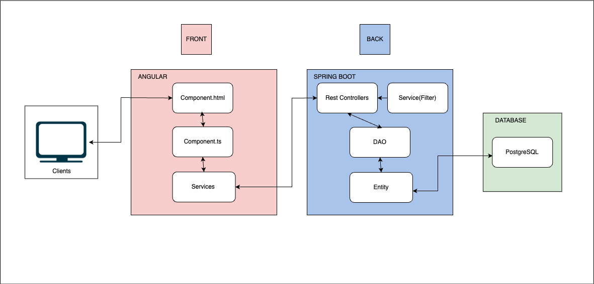

# Get Catchable, an Angular and Springboot project

## A fully fonctionnal website, that helps to find bugs and fishes (in ACNH) using filters

This project is a website that helps me to find catchable species in a game called **Animal Crossing New Horizon**.
In this game, catchable spawn on a certain month and within a specific time frame. Forcing me to check manually what can I 
find when connecting. In order not to waste my time doing that, I imagined this website (wasn't the first one to
think about it tbh). Here are the different steps to build my project : 

* thinking about the conception of this website, using a tool called looping (similar to diagrams.net).
* create the database using **PostgreSQL**
* create the backend with **Springboot** 
* create the frontend with **Angular** 

# A little diagram 
    

## How to install this project on your computer

1. Clone this project
2. Create your database, execute the SQL script
3. Launch the Springboot app
4. Build the Angular project to obtain the node modules and type the command ng serve
5. Check your http://localhost:4200/ and scroll 

## How to tweak this project for your own uses

I'd encourage you to clone and rename this project to use for your own purposes. 

## Find a bug ? 

If you found an issue or would like to submit an improvement to this project, please submit an issue using the
issue tab above. If you would like to submit a PR with a fix, reference the issue you created.

## Know issues (Work in progress)

This project is still ongoing, the backend is functional (not fished yet though). I'm starting to code the frontend
part now. The rest is coming soon.
